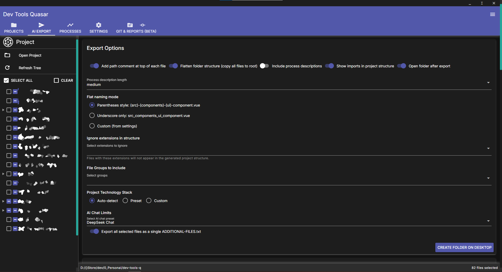
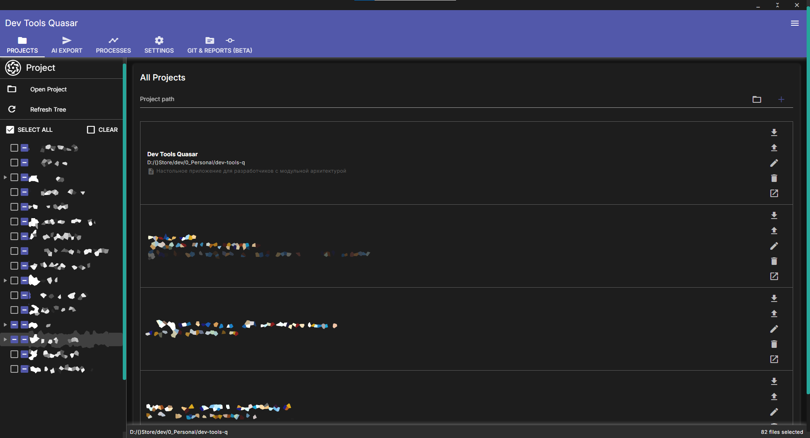
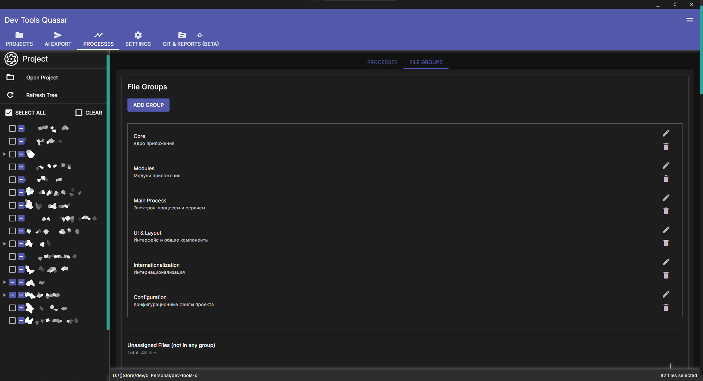
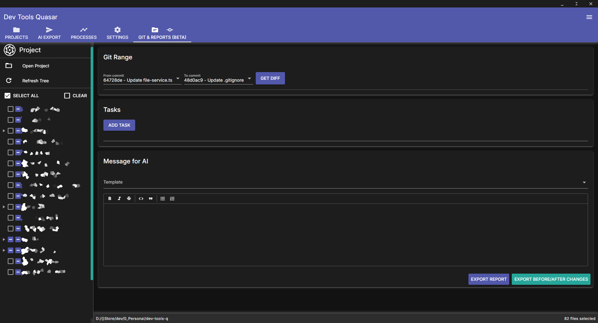

# 🧠 DevTools Workspace Manager (Showcase with Electron-app Release)

[](https://www.electronjs.org/)
[](https://vuejs.org/)
[](https://quasar.dev/)
[](https://www.typescriptlang.org/)
[](LICENSE)

> **A professional desktop environment for developers to organise projects, export structured context for AI assistants, manage business processes, and track Git changes — all in one place.**

 <!-- replace -->

---

## ✨ Features

### 🤖 AI‑Ready Export
- Select any set of files from your project tree.
- Add **line numbers**, **path comments**, and **flatten folder structure**.
- Automatically **compress overflow** to fit LLM context limits (ChatGPT, Claude, DeepSeek).
- Include **project structure**, **import maps**, and **tech stack** detection.

### 📂 Project Manager
- Keep a list of all your projects with custom **name**, **description**, and **secret notes**.
- Store project‑specific **ignore patterns**, **process definitions**, and **file groups**.
- **Import / export** individual project settings or full backup of all data.

### 🔄 Business Processes & File Groups
- Define **business processes** (e.g., “User Authentication”) with short, medium, and full descriptions.
- Group related files into **File Groups** (e.g., “Auth Components”).
- Link processes to groups and files – the export will automatically include all dependencies.
- Visualise **unassigned files** and quickly add them to any group.

### 🧬 Git Integration
- View commit history and **diff** between any two commits.
- Export **uncommitted changes** as `BEFORE-CHANGE.txt` / `AFTER-CHANGE.txt` for code review with AI.
- Create **task boards** with linked files, groups, and processes – generate AI reports with diff and custom message.

### ⚙️ Customisation & Developer Tools
- Global ignore patterns (presets for Node.js, Python, Java, etc.).
- **Flat export presets** – control how nested folders are renamed (e.g., `(src)_(components)_Button.vue`).
- Open DevTools and the app’s data folder directly from the UI.
- Full **data backup / restore** (settings + all project metadata).

---

## 🧩 Tech Stack

| Layer        | Technologies |
|--------------|--------------|
| **Frontend** | Vue 3, Quasar, Pinia, Vue Router, SCSS |
| **Backend**  | Electron, Node.js, IPC |
| **Tooling**  | TypeScript, Vite, ESLint, simple‑git, electron‑store, highlight.js |
| **Supported languages** | JavaScript/TypeScript, Python, Java, Go, Rust, C/C++, C#, Ruby, PHP, Swift, Kotlin |

---

## 🚀 How It Works (Showcase)

> ⚠️ **This repository is a showcase only. The source code is not public.**  
> Below is a conceptual overview of the application flow.

1. **Open a project** – select any folder on your machine.
2. The app scans the folder structure, respects `.gitignore` and your custom ignore patterns.
3. **Select files** via the interactive file tree.
4. Configure export options:
   - Add path comments / line numbers.
   - Flatten folder structure (choose naming style).
   - Include process descriptions and file groups.
   - Apply AI chat limits (max files / size) – overflow files are automatically compressed into `ADDITIONAL-FILES.txt`.
5. **Export** – a folder is created on your Desktop with:
   - All selected files (original names or flattened).
   - `PROJECT-STRUCTURE.md` – full tree + imports + tech stack.
   - `message.md` or `REPORT.md` – custom AI prompt, Git diff, tasks.
6. **Upload the folder** to ChatGPT, Claude, DeepSeek, or any LLM – get precise answers about your codebase.

---

## 📸 Screenshots

| Project Manager | Export Options |
|----------------|----------------|
|  |  |

| Processes & Groups | Git Reports |
|--------------------|--------------|
|  |  |

*(Replace with actual screenshots of your app)*

---

## 🧪 Demo (Conceptual)

```bash
# No public build available yet.
# The app is currently in private development.
